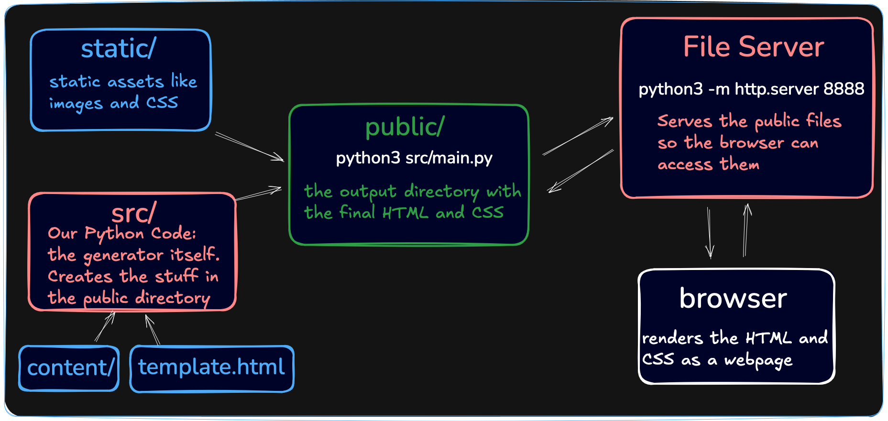

# 🛠 Static Site Generator in Python

Welcome to my very own **Static Site Generator**, built from scratch in Python.  
It transforms Markdown files into a fully functional static website using only standard libraries — no frameworks or external dependencies.

✨ **Live Demo**:  
👉 [Check out the website here](https://bayashat.github.io/Static-Site-Generator/)  
Powered by **GitHub Pages** — see how `.md` files are turned into real, navigable websites.

---

## 🚀 Features

- 🧱 Converts Markdown files (`.md`) to clean HTML pages
- 📂 Recursively supports nested directories (e.g., `/blog/tom/index.md`)
- 🔗 Supports inline Markdown (bold, italics, links)
- 🖼 Template-based design via `template.html`
- 🧪 Includes test scripts for robustness
- 🔄 Automatically copies static assets (like images, CSS)
- 🌐 Deployed to GitHub Pages

---

## 🔧 Project Structure

```plaintext
scripts/
├── main.sh          # Bash entrypoint to run the site generator locally
├── test.sh          # Run unit tests
├── build.sh         # Bash script to build the site

src/                 # Source code for the site generator
content/             # Markdown content source (input)
docs/                # Generated HTML output (final site)
template.html        # Reusable HTML template
```

---

## 🖼️ Architecture Overview



## 📈 How to Use
```bash
# Step 1: Build the site from Markdown
./scripts/build.sh

# Or directly with Python (from project root):
python3 -m src.generator.main.py

# Step 2: Open the generated site
```

## ✅ To-Do
- [ ] Add support for nested inline elements (e.g., bold inside italics)
- [ ] Implement CLI arguments for input/output directory
- [ ] Add support for Markdown images
- [ ] 📦 Create a hosted interactive web interface:
    - User sees a big Markdown editor and static file uploader
    - On submit: generate and render the full HTML preview from Markdown
    - Static assets (e.g. images) are uploaded and linked correctly
    - HTML page is displayed or downloadable

## 🤓 What I Learned
This project deepened my understanding of:
- 🔁 Recursive file walking and path handling
- 🧠 Parsing logic for both block and inline Markdown
- 🧩 HTML AST (abstract syntax tree) generation
- 🏗 Structuring Python projects with modular design
- 🧪 Simple testing and script automation
- ☁️ GitHub Pages integration for static site deployment

## 🌍 Live Site Screenshot
<p align="center">  </p>

---

> If you'd like to try it out or contribute, feel free to fork this repo or drop a ⭐ on GitHub!